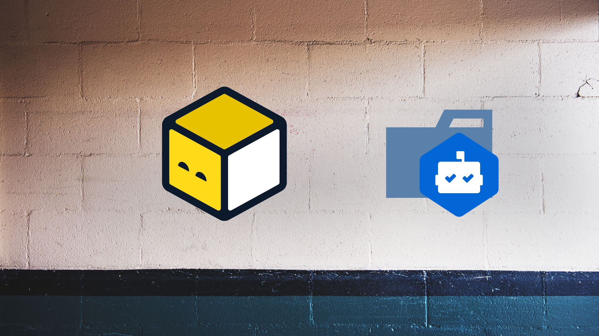

# Welcome to the Tofu Dependabot Project!



## Overview
Managing dependencies is critical to the software development lifecycle (SDLC), ensuring that your project stays up-to-date with the latest features and security fixes. 

Dependabot is a popular tool for automating dependency updates, and OpenTofu, is an open-source tool for managing IaC and can be integrated with it to keep your infrastructure configurations current. 

Let's explore how to set up and use OpenTofu with Dependabot.

```
├── .devcontainer
│   ├── Dockerfile
│   └── devcontainer.json
├── .github
│   ├── dependabot.yaml
│   └── workflows
│       ├── jekyll-gh-pages.yml
│       └── module_version.yaml
├── README.md
├── environments
│   ├── dev
│   │   └── main.tf
│   ├── prod
│   │   └── main.tf
│   └── stage
│       └── main.tf
└── modules
    └── network
        ├── main.tf
        ├── provider.tf
        └── variables.tf
```